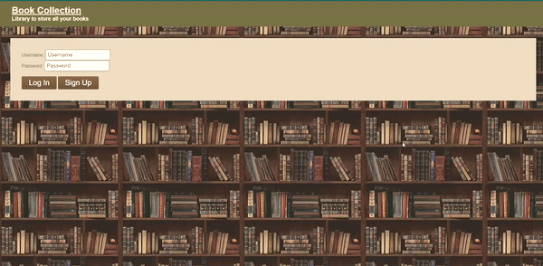
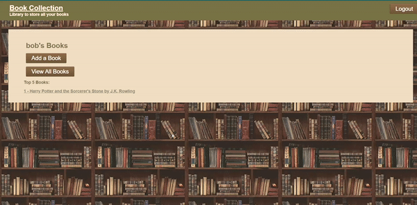

# BookCollection

A Sinatra App to keep track of books, their authors and which users posted them.

# Technologies
The following technologies were used in the production of Book Collection:

Ruby 2.6.0
bcrypt
sinatra
sinatra-activerecord
rack-flash3

# Features
Currently, Book Collection has the following features implemented:

Github User Authentication

New users have the ability to register an account on the sign-in page or sign up.

Adding and viewing Books

A user can add books as well as view all of the books added to their library.

# Installation:

On a local machine:

- Clone this Repo
- Run 'bundle install' from the root directory
- Run 'rails db:migrate'
- Run 'shotgun'
